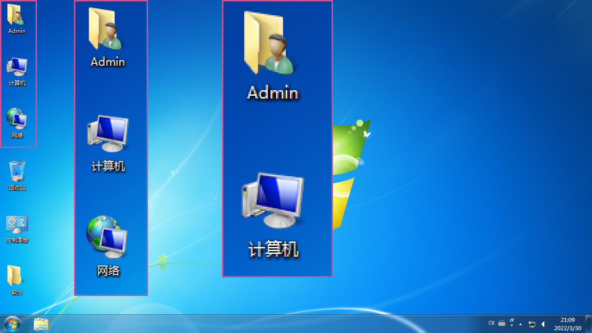

# 前言的前言  

不知道是什么样的契机，促使我开始心情复杂地动笔编写这方面的内容。我觉得大概是因为微软在 Win32 API 上的设计之糟糕，Win32 API 的使用之糟心，不同 Windows 大版本之间的差异和 Windows 10、Windows 11 不同年份版本之间的差异让我不得不捏着鼻子去动手处理高 DPI 相关的内容。  

有的人可能会向我推荐 [UWP](https://docs.microsoft.com/en-us/windows/uwp/) 或 [Windows App SDK (Project Re-union)](https://docs.microsoft.com/en-us/windows/apps/desktop/)。确实，它们非常现代化，而且自动帮开发者处理了大量高 DPI 相关的内容。但是代价呢？它们只能运行在 Windows 10、Windows 11 操作系统上，而直到现在（2022 年 4 月），全球仍然有一定存量的 Windows 7、Windows 8.x 用户，如果把目光放到国内（中国），Windows 7 用户群体更加庞大，很多高校、机关单位、公司、路边的商户等，电脑设备上运行的仍然是 Windows 7，或者 Windows 8.x（因为它对触屏操作的支持相对比较好，对配置要求也比较低，常见于银行门店、通信营业厅）。  

如果你是一名游戏开发者，并不一定需要照顾到这部分用户，甚至大胆地把最低操作系统要求定为 Windows 10，玩家也是可以接受的，Windows 10 [于 2015 年发布](https://docs.microsoft.com/zh-cn/lifecycle/products/windows-10-home-and-pro)，到现在（2022 年 4 月）已度过了 7 年岁月，已经进入功能稳定、不再大量修改的维护期（当然并不意味着它 Bug 数量就少或者使用起来稳定），按照微软的操作系统基本上长达 10 年的生命周期，再过 3 年，Windows 10 才会和 Windows 7、Windows 8.x 一样不再受到微软的支持（实际上微软已经确定，在 [2025 年就要终止对 Windows 10 的支持](https://docs.microsoft.com/zh-cn/lifecycle/products/windows-10-home-and-pro)），而 3 年之后，Windows 10 又会像 Windows 7、Windows 8.x 前辈们那样仍然拥有可观的用户存量。  

如果你希望开发一些兼容 Windows 7 的工程设计、工业控制等的窗口程序，那么对 Windows 7 的兼容仍然是必不可少的。  

当然，这并不意味着支持大家继续使用老旧的操作系统，只不过很多时候我们并没有别的选择，只能面对现实。  

# 前言  

这篇文章暂时不会提及代码，而是希望通过我的视角，来带领大家逐步接触一些相关概念。  

# Windows 文字渲染之丑  

不要误会，我不是想黑 Windows 的文字渲染。  

因为它在戴着镣铐跳舞。  

一直以来，Windows 就因为其良好的兼容性和一定程度的开放性，得以广泛地运行在各式各样的设备上。自然，其画面也会在各式各样的显示设备上展示给用户。这里就存在一个问题，不像苹果公司能以昂贵的价格、统一的标准为用户提供高质量的硬件设备，微软无法得知用户是通过什么样的显示设备看到 Windows 用户界面。当苹果公司的产品已经进入了视网膜分辨率时代、大量安卓移动设备的像素密度不断提升的时候，Windows 用户可能仍然在使用诸如 1280x720、1280x800、1366x768、1440x900、1600x600、1920x1080 等分辨率、尺寸又达到 14、15、17、24 甚至 27 寸的显示器。  

你可能会觉得：这不是很正常的事情吗？  

是的，这很正常，因为不是谁都能买得起 2.5K、4K 分辨率的显示设备，也不是谁都能负担得起能支撑这些显示器的显卡的价格。但是大量的用户面对颇具颗粒感、还带有彩边的 Windows 文字时，觉得应该第一个背锅的，不是自己的钱包，而是微软（这里没有看不起这些用户的意思，因为我自己曾经也只能用大果粒屏幕。我只是在阐述事实）。  

当然，很多人或多或少也听说过 [MAC Type](https://www.mactype.net/)，其目标在于替代和接管 Windows 系统的文本渲染引擎。但是很多用户并没有意识到，即使安装了 MAC Type，如果他们仍然在使用低分辨率、低像素密度的显示器，Windows 的字体显示出来也不会变得更清晰，因为这不是依靠软件就能解决的物理问题。  

# 高分辨率、高像素密度屏幕时代

